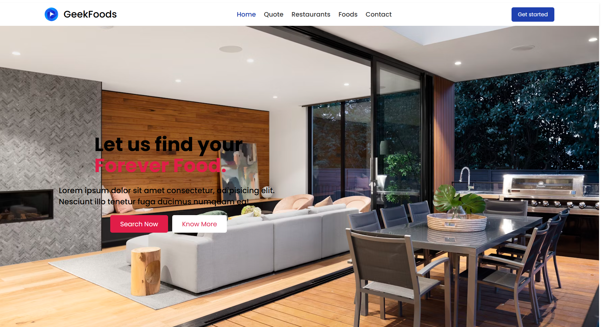

# GeekFood 🍔



## About GeekFood
**GeekFood** is a modern, fully responsive landing page designed for a future food ordering platform. It features an intuitive and visually appealing interface to showcase delicious meals and attract potential users.

### 🔗 Hosted Link
[Live Demo](https://geeksfood-react.vercel.app/)

## Features 🚀
- 🍽️ **Attractive UI** - A clean and modern design to enhance user engagement.
- 📱 **Fully Responsive** - Works smoothly on mobile, tablet, and desktop.
- 🎨 **Custom Styling** - Styled with Tailwind CSS for a sleek appearance.

## Folder Structure 📁
```
/geekfood
│── /public
│── /src
│   │── /assets (Contains images and icons)
│   │── /components (Reusable UI components)
│   │── /pages (Page components)
│   │── /utils (Helper functions)
│   │── App.js
│   │── index.js
│── package.json
│── README.md
```
## Installation & Setup ⚡
To set up and run GeekFood on your local machine:

1. **Clone the repository:**
   ```sh
   git clone https://github.com/yourusername/geekfood.git
   ```

2. **Navigate to the project folder:**
   ```sh
   cd geekfood
   ```

3. **Install dependencies:**
   ```sh
   npm install
   ```

4. **Run the project:**
   ```sh
   npm start
   ```
